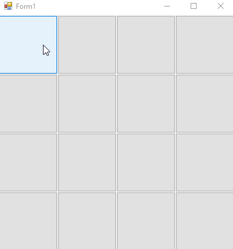

# [.NET Framework] Memory Game
## Game originally created on 2020-05.
#### Last opened with Microsoft Visual Studio 2017. .NET Framework version: 4.6.1 ####

A simple memory game with 16 cards. Each restart 8 images are selected from all of the imported ones.
If 2 different images are opened, they will be closed on next image open or after 3 secods. Game created for education purposes.

